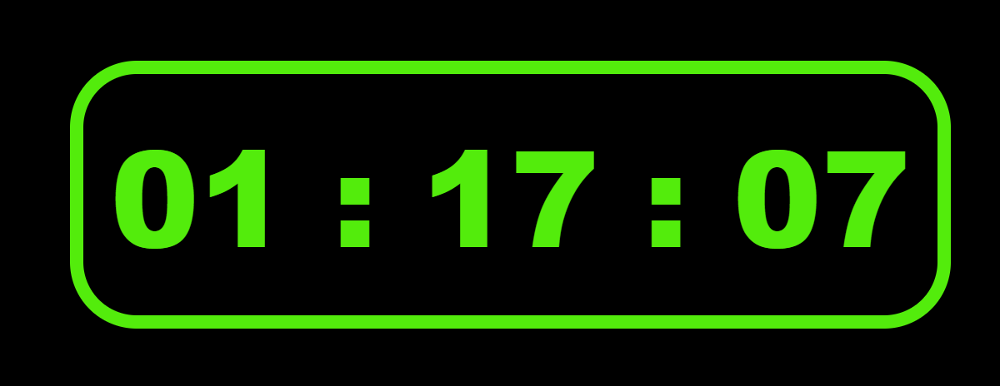

# RELÓGIO DIGITAL JS
---
> Projeto usando JS / HTML / CSS !

   PROJETO BÁSICO COM OBJETIVO DE EXPLORAR A FUNÇÃO DATA / HORA !
   
   

   ###### Técnicas aplicadas:

   - Primeira versão do projeto.
   - função data e hora js.
   - box model css.

   Jorge Augusto - [linkedin](https://www.linkedin.com/in/jorgeaugusto88/)
